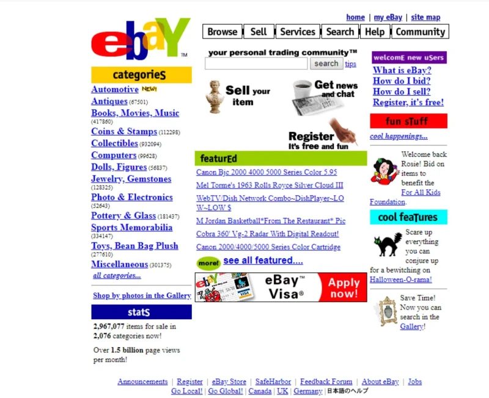

# 환경친화적 블로그 만들기

[무어의 법칙](https://ko.wikipedia.org/wiki/무어의_법칙)에 따라, 시간이 지날수록 하드웨어의 성능은 향상되고 인터넷이 빨라지며 웹사이트의 크기가 비대해지고 있다.

우리가 최근 인터넷이라고 부르는 일명 [월드 와이드 웹](https://ko.wikipedia.org/wiki/월드_와이드_웹)은 1989년에 [팀 버너스 리](https://ko.wikipedia.org/wiki/팀_버너스리)가 만들었는데, 이때는 다들 [전화 접속 모뎀](https://ko.wikipedia.org/wiki/전화_접속)을 사용했다.

보통 최대 속도가 2.4Kbps 정도 되었는데, 이는 1초에 300 byte를 다운로드 받을 수 있는 속도이다.  
[구글 검색 창](www.google.com)을 여는데 대략 700초가 걸리는데 놀랍게도 css나 font 같은 부가적인 에셋들을 전혀 불러오지 않았을때 결과다.

물론 요즘은 5G니 뭐니 하면서 속도가 거의 1Gbps에 가깝게 나오고.  
인터넷이 느린 환경의 경우에도 최소 5Mbps 이상은 나오기 때문에 일상생활에 있어서 전혀 불편함이 없지만,

[남극](https://news.hada.io/topic?id=15109) 같이 특이한 위치에서도 빠르고,  
세계전쟁으로 인해 최신 전자기기가 전부 먹통이 되어서 과거로 회기하는 등의 상황에서도 살아남는!

그리고 전 세계 그 어디에서도 굉장히 빠른 속도로 접속할 수 있는 단순한 블로그를 만들어 보고 싶었다.

힙스터 기질이 있는건지.. 옛날 웹사이트 디자인에 되게 끌린다. 정겹기도 하고.
