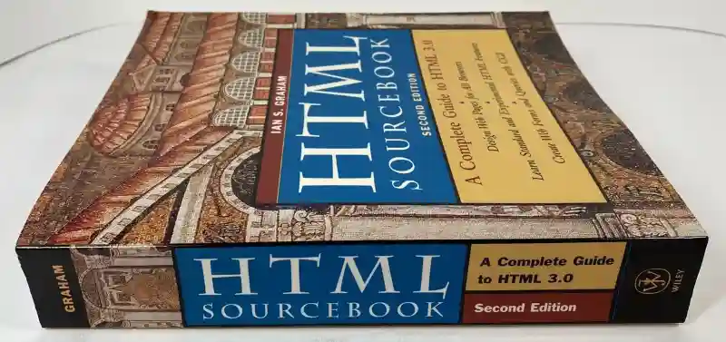

# 환경친화적 블로그 만들기

[무어의 법칙](https://ko.wikipedia.org/wiki/무어의_법칙)에 따라, 시간이 지날수록 하드웨어의 성능은 향상되고 인터넷이 빨라지며 웹사이트의 크기가 비대해지고 있다.

우리가 최근 인터넷이라고 부르는 일명 [월드 와이드 웹](https://ko.wikipedia.org/wiki/월드_와이드_웹)은 1989년에 [팀 버너스 리](https://ko.wikipedia.org/wiki/팀_버너스리)가 만들었는데, 이때는 다들 [전화 접속 모뎀](https://ko.wikipedia.org/wiki/전화_접속)을 사용했다.

최대 속도가 2.4Kbps 정도였는데, 1초에 300 byte를 다운로드 받을 수 있는 속도이다.  
css나 font 같은 부가적인 에셋들을 불러오지 않는다고 가정하고 2024년 [구글 검색 창](www.google.com)을 여는데 대략 700초가 걸린다고 볼 수 있다.

요즘은 5G니 뭐니 하면서 속도가 거의 1Gbps에 가깝게 나오고.  
인터넷이 느린 환경의 경우에도 최소 5Mbps 이상은 나오기 때문에 우리는 일상생활에 있어서 전혀 불편함이 없지만,

여전히 [남극](https://news.hada.io/topic?id=15109) 같이 열악한 환경에서 웹서핑을 하는 사람들이 있다.

현 시대의 [모바일 데이터 무제한 요금제](https://www.moyoplan.com/tips/요금제-조회/data-qos)의 경우 크게 400Kbps, 1Mbps, 3Mbps, 5Mbps로 분류가 되고 있으며  
알뜰폰 요금제에서는 1Mbps가 흔한 것 같다. (1Mbps는 1초에 125KB를 다운로드 할 수 있는 속도이다)

남극도 2Mbps가 나오는 걸 감안하면 데이터를 다 썼을때 제한되는 속도는 매우매우 열악하다고 볼 수 있다.

나는 개발자라는 직업을 가지기 이전부터 이 요금제를 사용했는데 데이터가 5GB 정도로 매우 적어서 매번 데이터를 켰다 껐다 했다.  
그러다 운 없이 다 써버리게 되면 속도 제한이 걸리게 되고 이로 인해 화병이 생겨 휴대폰을 던지는 일도 일상다반사였다.  
(다행히도 지금은 100GB + 5Mbps 요금제를 사용하여 휴대폰을 던지지 않는다)

컨텐츠를 보기 위해 사용하는 데이터의 양이 컨텐츠의 가치와 비등하게 올라갈까?

나는 전혀 그렇지 않다고 생각한다.

아무 컨텐츠 없이 흰 화면만 보여주는 웹사이트에서 [jQuery](https://ko.wikipedia.org/wiki/JQuery)나 [React](<https://ko.wikipedia.org/wiki/리액트_(자바스크립트_라이브러리)>)를 불러온다면? 최소 수백 KB를 다운로드 해야 한다.

개발자 입장에서는 이런 라이브러리들을 사용하는 것이 얼마나 큰 가치를 제공하는지 쉽게 알 수 있지만  
고객 입장에서는 오히려 부담스러운 페인포인트로 작용을 할 것이다.

물론 이는 어떤 고객을 타겟팅 하느냐에 따라 정도가 크게 달라질 수 있다.

이번에 나는 블로그를 다시 만들면서 아래 요소들에 집중하며 개발을 했다.

1. 전 세계 그 어디에서도 굉장히 빠른 속도로 접속할 수 있어야 한다.
2. 인프라 유지비용이 없어야 한다.
3. 내 시간을 온전히 글 작성에만 쏟아부을 수 있어야 한다.

---

## 아이디어

[No CSS Club](https://nocss.club)이 나에게 큰 영감을 주었다.

<iframe width="560" height="315" src="https://www.youtube.com/embed/T3lEM26r_2s?si=j5qFUhfyqaY7U5ZG" title="YouTube video player" frameborder="0" allow="accelerometer; autoplay; clipboard-write; encrypted-media; gyroscope; picture-in-picture; web-share" referrerpolicy="strict-origin-when-cross-origin" allowfullscreen></iframe>

CSS, JS를 쓰지 않아도 예쁜 웹사이트를 만들 수 있다. (한계가 명확하긴 하지만)

적어도 블로그를 만들때에 있어서는 안써도 될 것 같다.

지금은 사장된 고대 흑마법을 잘 부리면 HTML 만으로도 어느정도 스타일링을 할 수 있다.

- 폰트를 적용하고 싶을때 [font](https://developer.mozilla.org/en-US/docs/Web/HTML/Element/font) 태그를 쓰기
- 배경색을 적용하고 싶을때 [body](https://developer.mozilla.org/ko/docs/Web/HTML/Element/body) 태그에 bgcolor 옵션을 주기
- 하이퍼텍스트에 색을 적용하고 싶을때 [body](https://developer.mozilla.org/ko/docs/Web/HTML/Element/body) 태그에 link 옵션을 주기
- 가운데 정렬을 하고 싶을때 [center](https://developer.mozilla.org/ko/docs/Web/HTML/Element/center) 태그를 쓰기
- 글자 크기를 키우고 싶을때 [big](https://developer.mozilla.org/en-US/docs/Web/HTML/Element/big) 태그를 쓰기

이외에도 정말 다양한 흑마법이 존재하고 잘 찾아보면 블로그를 만들때 필요한 기능들은 HTML에 다 있을 것 같다.

이런 책을 봐야해서 문제지만..

심지어 대부분 deprecated 된지 꽤 된 기술들이라 미래가 보장되지 않는다.

## 구조

[no-css-blog](https://www.npmjs.com/package/no-css-blog) CLI 도구를 만들었다. 자세한 동작은 다음과 같다.

배포는 아래와 같은 순서로 진행이 된다.

### 특징

1. JS, CSS를 사용하지 않았다. HTML 하나면 충분하다.
2. Cloudflare을 사용하여 서버 비용 제로에, 통신 병목까지 줄였다.
3. 마크다운 문서를 HTML로 변환하는 방식을 택하여 글 작성이 용이하다.
4. 모든 이미지는 용량 최적화를 위해 [exif-frame](https://github.com/yurucam/exif-frame)을 사용하여 [WebP](https://ko.wikipedia.org/wiki/WebP) 형식으로 변환한다.

---

## 마치며
